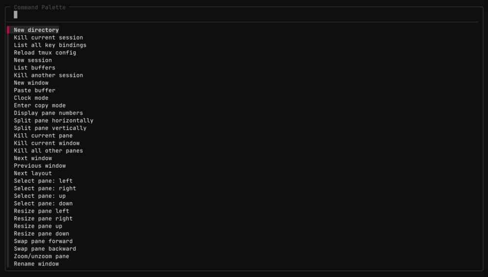

# tmux-palette

A fzf command palette for tmux. Press a key, search for any command, create a directory or add your own custom commands. Most recently used commands float to the top.



## Quick Start

- `prefix + P`: open the command palette
- Type to fuzzy search, `Enter` to execute, `Esc` to close

## Install (TPM)

In your `tmux.conf`

```tmux
set -g @plugin 'tmux-plugins/tpm'
set -g @plugin 'leohenon/tmux-palette'

run '~/.tmux/plugins/tpm/tpm'
```

Reload tmux and press `prefix + I` to install plugins.

## Commands

### Panes

Split, select, resize, swap, zoom, rotate, break to window, move to another window, mark, sync, copy mode.

### Windows

New, kill, next/previous, last, rename, move left/right, swap with another.

### Sessions

New (from directory picker), switch, kill current, kill another, last, next/previous, rename.

### Other

New directory (pick a parent, name it), list key bindings, list buffers, show messages, reload config, paste buffer, clear history, detach, clock.

## Custom Commands

Add your own commands by creating `~/.tmux/palette_commands` with tab-separated entries:

```
My command	send-keys 'echo hello' Enter
Restart server	run-shell 'systemctl restart myapp'
```

Each line is `Label<TAB>tmux-command`.

## Options

```tmux
set -g @tmux_palette_key 'P'
set -g @tmux_palette_esc 'back'
```

Notes:

- Default keybinding is `prefix + P`.
- Esc in sub-lists: `back` returns to the palette (default), `close` exits.
- Command history is stored in `~/.tmux/palette_history`. Recently used commands appear first.

## Requirements

- tmux 3.2+
- fzf 0.35+
- bash 4+

## License

[MIT](LICENSE)
